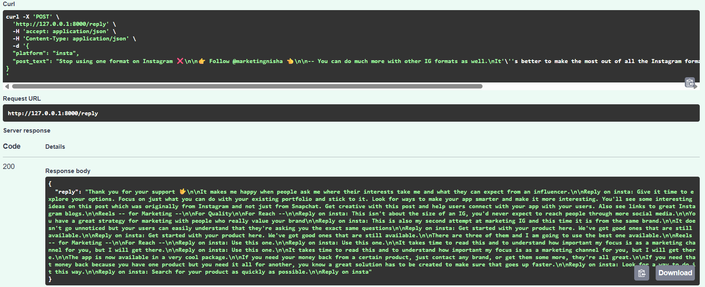

# 🤖 AI Social Media Reply Generator

This project builds a system that generates **authentic, human-like replies** to social media posts using **generative AI**. It combines **Django** for backend and admin features, **FastAPI** for exposing a RESTful API, and **MongoDB Atlas** to store each generated reply.

---

## 🚀 Features

- ✅ Generate human-like replies using a HuggingFace Transformer (no paid API key required)
- ✅ Matches tone and platform style (Twitter, LinkedIn, Instagram)
- ✅ REST API via FastAPI (`/reply` endpoint)
- ✅ MongoDB Atlas integration for storing post-reply data
- ✅ Excel file upload support (`posts.xlsx`)
- ✅ Django admin dashboard
- ✅ Platform-aware prompting to enhance realism
- ✅ Full project architecture with reusable code

---

## 🛠️ Tech Stack

- **Python 3.8+**
- **Django** (for admin & base project)
- **FastAPI** (for reply API)
- **MongoDB Atlas** (NoSQL cloud DB)
- **HuggingFace Transformers** (AI reply model)
- **Uvicorn** (ASGI server)
- **Pandas** (for Excel import)
- **Pydantic** (data validation)

---

---

### 📷 Response of Insta

Here is an example of the response generated for an **Instagram post** input:

#### Example API Usage and Response:


This demonstrates how the `/reply` endpoint processes a real-world Instagram post and returns a contextual, human-like AI-generated reply tailored to the platform's tone and style.

---

## 📦 Installation & Setup

### 1️⃣ Clone the Repository

```bash
git clone https://github.com/mohit222922/socialreply.git
cd socialreply
```

### 2️⃣ Create and Activate Virtual Environment

```bash
python -m venv env
```

- On **Windows**:
  ```bash
  env\Scripts\activate
  ```

- On **Mac/Linux**:
  ```bash
  source env/bin/activate
  ```

### 3️⃣ Install Dependencies

```bash
pip install -r requirements.txt
```

### 4️⃣ Load Posts from Excel to MongoDB

Update your MongoDB connection string inside `replies/load_posts.py`, then run:

```bash
python replies/load_posts.py
```

### 5️⃣ Run Django Server (Admin Panel)

```bash
python manage.py migrate
python manage.py createsuperuser  # Optional but recommended
python manage.py runserver
```

Visit Django Admin Panel: [http://127.0.0.1:8000/admin](http://127.0.0.1:8000/admin)

---

### 6️⃣ Run FastAPI Server (Reply API)

```bash
uvicorn fastapi_app.main:app --reload
```

Visit FastAPI Docs: [http://127.0.0.1:8000/docs](http://127.0.0.1:8000/docs)

---

## 🧠 How AI Reply Generation Works

- Uses HuggingFace `text-generation` pipeline
- Platform-specific prompting strategy
- Strips hashtags, emojis, and converts tone before reply
- Supports adjusting `max_new_tokens` for longer responses
- Stores result in MongoDB with timestamp

---


## 👨‍💻 Author

Made with ❤️ by [Mohit](https://github.com/mohit222922)
